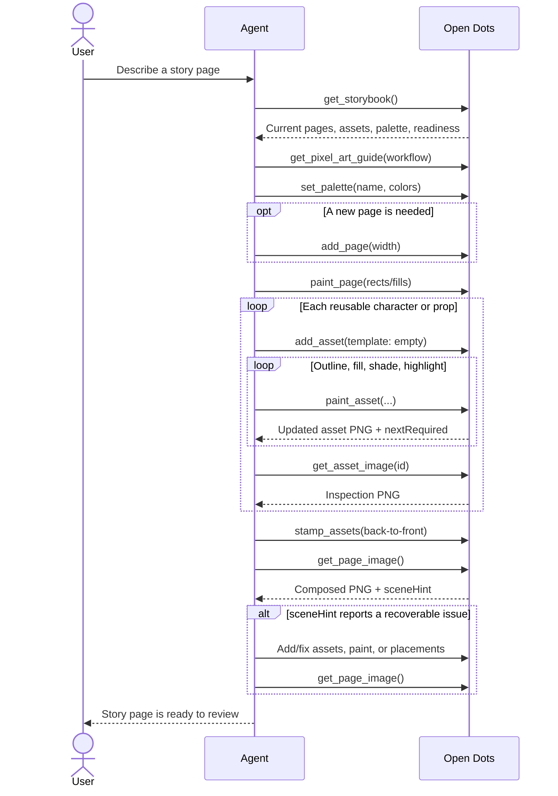

# Open Dots

A picture-book canvas. Draw each page, place words and shapes on the art, then present the story — or ask an agent to paint through WebMCP.

Built for the [WebMCP Challenge](https://webmcp.devpost.com/). Theme tokens come from [DESIGN.md](./DESIGN.md) (`npx getdesign@latest add figma`).

**Live URL:** [https://opendots.thach.app](https://opendots.thach.app)

## What it is

You land on a blank landscape page. Draw the scene, place words with **Text** and pixel decorations with **Shape**, then **Present** to flip through the book.

- **You** draw with pencil, eraser, and fill. **Text** writes words (font + size). **Shape** drag-sizes a circle, rectangle, square, heart, or star into the pixel grid. Save a stamp as an **asset** and reuse it.
- **An agent** uses `document.modelContext` tools. For complex art, build small **assets** (`add_asset`) and **stamp** them (`stamp_assets`); avoid painting entire pages pixel-by-pixel.
- **Present** reads the book full-screen. Arrow keys or the sides of the page turn slides.

## WebMCP tools (12)

Agent-focused tools inspired by [pixel-art-cli](https://github.com/vossenwout/pixel-art-cli) — its whole surface is `set_pixel`/`fill_rect`/`line`/`clear` + export/undo, plus a mandatory look-at-the-PNG loop. Open Dots matches that minimalism and adds book features (pages, reusable assets, stamp) and a bulk-ops advantage: `paint_asset`/`paint_page` take **rects/lines/fills/pixels** in one call, so a single rect fills any block server-side (no per-pixel cap) and `color ""` erases. UI-only controls (brush, workshop, tool picker, color swatch, undo button) are not exposed — agents draw directly and verify with the returned image.

| Tool | What it does |
| --- | --- |
| `get_pixel_art_guide` | **Start here** — pixel-art playbook (composition, shading, palettes, draw-look-fix loop). Topics: workflow, shading, composition, tools, full |
| `get_storybook` | Pages + overlay placements, palettes + `activePaletteId`, asset ids/names/sizes, editor state, `webmcp.ready` |
| `get_asset_image` | Asset PNG + stats + rows for vision/text compare (scale 1–8) |
| `get_page_image` | Page/region PNG + stats + `sceneHint` (few placements, huge stamps, full-page paint, noisy colorCount) |
| `set_palette` | Create/select a named color profile (`name` + any number of #rrggbb swatches). Default is never overwritten; extra colors can be used inline in draw ops |
| `add_page` | New page + optional pixel density (`width` 48–256, height follows 16:9) |
| `select_page` | Select a page by index |
| `add_asset` | Create sprite — indexed bitmap, template `empty`, hex `rows`, `fill`, or page-rect copy |
| `paint_asset` | Bulk sprite ops — `rects`/`lines`/`fills` + ≤4,096 detail `pixels`/call; returns inline PNG |
| `paint_page` | Page backgrounds/touch-ups — same `rects`/`lines`/`fills`/`pixels` ops; `color ""` erases |
| `stamp_assets` | Overlay placements on the page (order = z-index, not baked into pixels) |
| `place_text` | Rasterize words into page pixels |

Pass colors inline on each draw op. Choose page density with `add_page` `width`. Erase by painting `color ""`, then repaint using the returned PNG. Decorations use `rects`/`lines`/`fills` or stamped assets — not a story form or caption box.

Deleting pages or assets stays in the human editor, where it requires explicit confirmation.

### Agent creation journey



## Run

```bash
npm install
npm run dev
```

Open [http://localhost:3000](http://localhost:3000).

## Test WebMCP

1. Draw on the canvas, or add a page.
2. In ChatGPT’s in-app browser or Chrome with `chrome://flags/#enable-webmcp-testing`, tell the agent your story and ask it to `get_pixel_art_guide` → `set_palette` → `add_asset` → `stamp_assets`.
3. The same tools register via `document.modelContext.registerTool`. A page refresh unloads that registry — re-fetch tools after the page settles (`get_storybook.webmcp.ready`) before mutating.

## WebMCP best practices (how the harness follows the spec)

Aligned with [Chrome's WebMCP docs](https://developer.chrome.com/docs/ai/webmcp) and [eval guidance](https://developer.chrome.com/docs/ai/webmcp/evals):

- **`readOnlyHint` on every tool.** `withToolAnnotations` (`lib/webmcp-polyfill.ts`) defaults a missing hint to write (`false`), so hosts that classify site tools (Cursor, ChatGPT) never silently drop the mutating ones.
- **JSON Schema + intent-rich descriptions.** Each tool declares an `inputSchema` (`type: "object"`, typed properties, `required`, `enum`s) and a description that maps user intent to arguments — the primary lever against wrong-tool / wrong-arg failures.
- **Graceful errors.** Validation problems return `toolError` (`isError: true`), and `withSafeExecute` (`lib/register-tools.ts`) wraps every `execute` so an unexpected throw surfaces as a structured `isError` result instead of a rejected call the model can't reason about.
- **Registration lifecycle.** Tools are registered for the page's lifetime (not a component's) and refreshed in place under HMR, so React re-renders never invalidate a host's tool snapshot. Initial registration is batched with a single `toolchange` (`silent` + `flushToolChanges`).
- **Vision loop.** Mutating asset tools auto-return an inline PNG plus `passHint`/`nextRequired`, enforcing compare-before-next-pass.

We evaluated adopting [`use-webmcp-tool`](https://www.npmjs.com/package/use-webmcp-tool) (Chrome's `useWebMCP` hook) and **skipped it**: it ties tool registration to component mount/unmount and aborts on unmount, which conflicts with the deliberate page-lifetime + HMR-safe registration above. We already match its result-normalization behavior via `toolResult`/`toolError` + `withSafeExecute`.

## Evals

Chrome-format eval suite in [`evals/open-dots.evals.json`](./evals/open-dots.evals.json) (tool-in-isolation cases + an end-to-end journey). Run the deterministic, LLM-free layer in CI:

```bash
npm run test:webmcp
```

It lints every tool (name, description, schema, `readOnlyHint`), exercises validation + graceful-error paths with no browser, checks the eval suite only references real tools/arguments, and emits `evals/schema.json`. For the probabilistic layer, point the official CLI at the deployed site:

```bash
npx webmcp-evals browser -u https://opendots.thach.app -e evals/open-dots.evals.json
```

See [`evals/README.md`](./evals/README.md) for details.

## License

MIT. See [LICENSE](./LICENSE).
